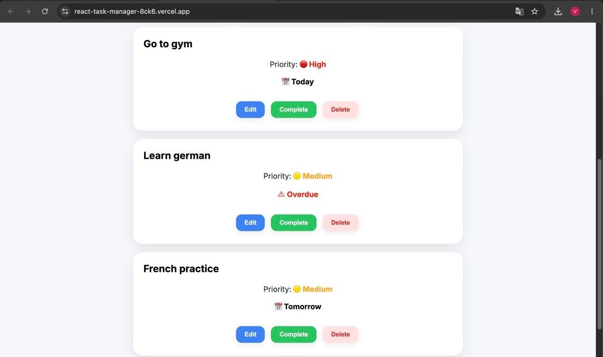
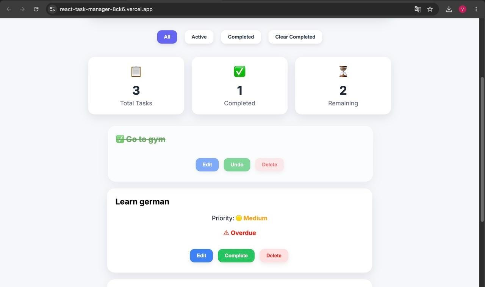
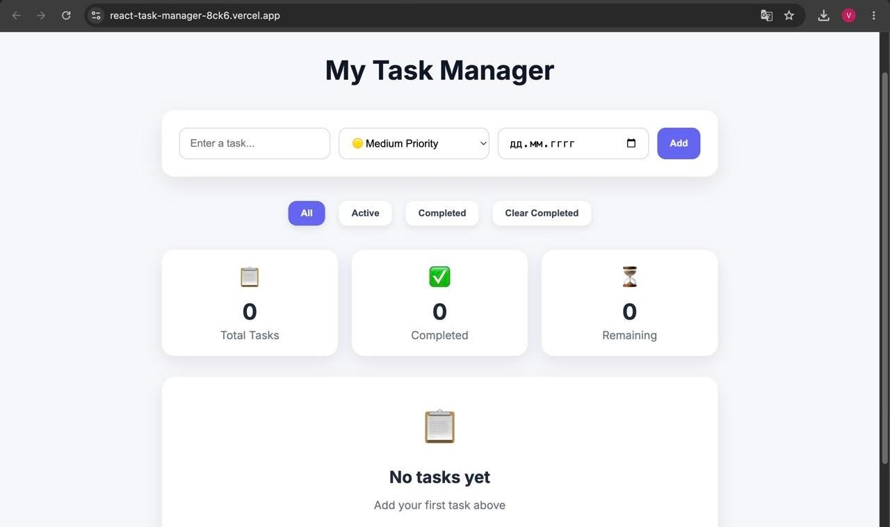

# 📋 React Task Manager

A modern and responsive task management application built with **React** and **Vite**. The application helps users organize daily tasks with an intuitive interface, priority management, due dates, filtering options, and persistent local storage.

## 🚀 Live Demo

🔗 https://react-task-manager-8ck6.vercel.app

## ✨ Features

* Create, edit, and delete tasks
* Mark tasks as completed or undo completed tasks
* Filter tasks (All / Active / Completed)
* Assign High, Medium, or Low priority
* Add due dates with user-friendly formatting
* Expand completed tasks to view details
* Automatic Local Storage persistence
* Live task statistics
* Responsive design for desktop, tablet, and mobile
* Modern UI with smooth animations
* Empty state when no tasks are available

## 🛠️ Technologies

* React
* JavaScript (ES6+)
* Vite
* HTML5
* CSS3
* Local Storage API
* Git & GitHub
* Vercel

## 📸 Screenshots

### Dashboard

### Completed Task

### Empty State

### Tablet View

.jpeg)

### Mobile View

.jpeg)

## 💡 What I Learned

This project helped me strengthen my skills in:

* React Hooks (`useState`, `useEffect`)
* Component-based architecture
* State and props management
* Conditional rendering
* Local Storage integration
* Responsive UI development
* Modern CSS styling and animations
* Git & GitHub workflow
* Deploying React applications with Vercel

## 👩‍💻 Author

**Vanesa Poghosyan**

GitHub: https://github.com/vanesapoghosyann

Thank you for visiting this repository! If you enjoyed this project, feel free to leave a ⭐ on GitHub.